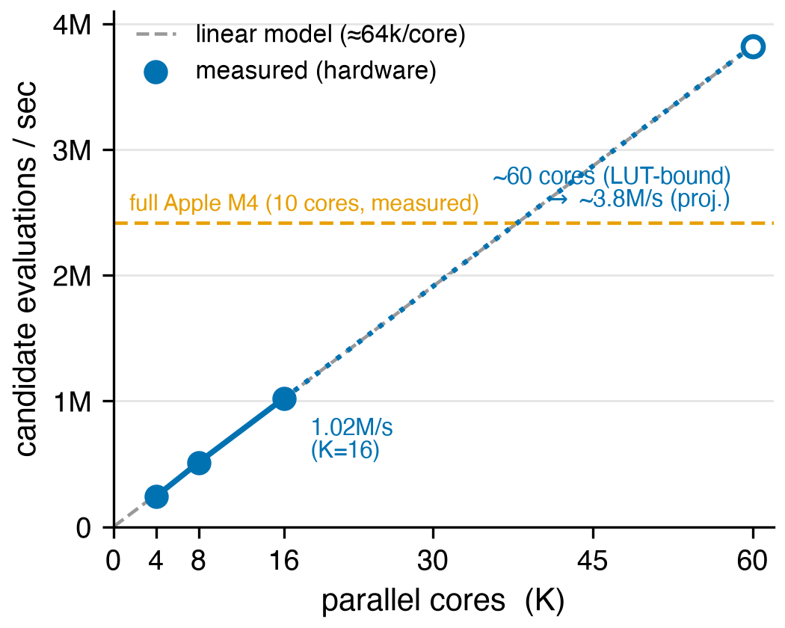
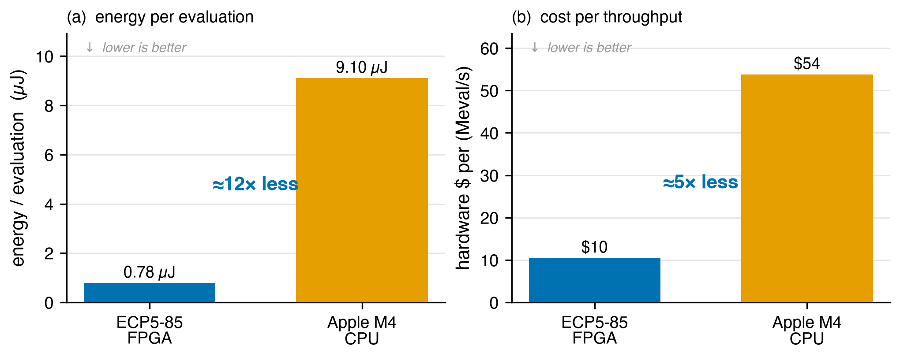

# A Million Combinator Reductions a Second: Hardware-Accelerated Evolution of SKI Programs on Cloud FPGAs

**Late-Breaking Work draft — ALIFE 2026**
Target deadline: **20 July 2026.** *(Confirm exact length/template against the official LBW CfP — ALIFE LBW is typically a 2-page extended abstract in the conference template; this draft is content to port.)*

**Authors (placeholder):** Mark Santolucito, Christian Scaff, Andrew Bonilla, Zenas Boamah — Barnard PL Labs. *(Adjust author list/order as appropriate.)*

---

## Abstract

Evolutionary search over *computation* — programs, circuits, reaction networks — is a recurring theme in artificial life, but it is chronically bottlenecked by the cost of *evaluating* candidates. We present a massively-parallel evolutionary substrate that evolves SKI combinatory-logic programs entirely in FPGA fabric: each soft core generates, reduces (to weak head normal form via in-place graph reduction in block RAM), and scores candidates against a target function with no host in the inner loop. On a single low-cost ECP5 FPGA we measure **>1.0 million candidate evaluations per second** across 16 parallel cores, scaling linearly with core count, and synthesis shows ~60 cores fit on the device (a projected ~3.8 M eval/s). Against a bit-identical C implementation on a modern CPU (Apple M4), the FPGA matches a full chip's throughput at roughly **one-twelfth the power**, and the architecture projects to ~45 datacenter-FPGA cards matching a 100k-CPU farm at ~80× lower power. The system is built and run entirely through **Manhattan Reasoning Gym (MRG)**, a cloud FPGA platform that lets researchers submit HDL and drive hardware over a simple SDK without owning boards — lowering the barrier to hardware-accelerated artificial-life experiments. All designs and benchmarks are open and reproducible on MRG.

---

## 1. Motivation

Artificial life has a long tradition of *evolving computation*: Tierra's self-replicating machine code, Fontana & Buss's AlChemy (an algorithmic chemistry over λ-terms), and the broader thread of combinator/algorithmic chemistries in which programs are the molecules and reduction is the reaction. SKI combinatory logic is an especially clean substrate for this lineage — three primitives (`S`, `K`, `I`), one operation (application), Turing-complete, and free of variable binding, so terms are pure trees that mutate and recombine trivially.

The persistent obstacle is **evaluation throughput**. Evolutionary and open-ended searches are dominated by the cost of reducing/executing candidates and scoring them; richer experiments (larger populations, longer runs, harder targets, quality-diversity sweeps) are simply unaffordable on CPUs at the scale ALIFE questions often demand. We ask: *what becomes possible if candidate evaluation is 10⁶–10⁸/sec?*

Our answer is to move the entire evolutionary inner loop — generation, reduction, fitness — onto FPGA fabric, replicate it, and make it accessible through a cloud platform so the result is usable by researchers without hardware.

## 2. System

**Substrate.** A candidate is a pure SKI term, stored as a graph of 32-bit nodes in block RAM (tag + two child pointers). The three rewrite rules are `I x → x`, `K x y → x`, `S x y z → x z (y z)`.

**On-chip evolutionary core.** Each soft core runs autonomously:
1. **Generation** — an LFSR drives a generator that writes a random *well-formed* term: every application node references only earlier nodes, so terms are acyclic and in-range by construction.
2. **Reduction** — a weak-head-normal-form graph reducer unwinds the left spine with a 3-deep sliding window (SKI's widest rule needs only three arguments, so no unbounded stack), rewrites the head redex in place to preserve sharing, and guards against non-termination with a per-candidate step cap.
3. **Fitness** — boolean targets use Church encodings (`TRUE = K`, `FALSE = K I`); a candidate's output is read by applying it to two inert sentinel atoms (`cand b₁…bₙ T F` reduces to `T`/`F`). Fitness is the number of truth-table rows matched. Divergent or malformed candidates score zero by construction.

**Parallel engine.** *K* cores share one Wishbone control interface; the host writes the target and a seed, then reads a global candidate counter and the best fitness found. There is **no host traffic in the inner loop** — the cores share nothing, so throughput tracks core count.

**Platform.** The whole thing is developed, built (Amaranth → Yosys → nextpnr-ECP5 → bitstream), flashed, and driven through **Manhattan Reasoning Gym**: HDL is submitted over an SDK, programmed onto an idle cloud FPGA, and controlled with simple register reads/writes. No board ownership, no local toolchain.

## 3. Results

All measurements: evolving 2-input XOR (`cand_size=16`, step cap 2000), ~5 s free-running windows, on an ECP5-85 (`LFE5UM5G-85F`, 50 MHz, ≈$40, ≈3 W).

**Throughput scales linearly with cores; the search solves the target.**

| K cores | candidates/sec | per core | XOR |
|--:|--:|--:|:--|
| 4  | 241,670   | 60,417 | solved 4/4 |
| 8  | 512,152   | 64,019 | solved 4/4 |
| 16 | **1,021,698** | 63,856 | solved 4/4 |

4→16 cores (4×) yields 4.23× throughput; per-core rate is flat (~63k/s) — the cores are genuinely independent (Fig. 1).

**Figure 1.** Candidate-evaluation throughput scales linearly with on-chip cores. Three hardware-measured points (K=4, 8, 16) lie on a ~63.7k-eval/s/core line; synthesis bounds the device at ~60 cores (LUT-limited), projecting **~3.8 M eval/s** on one ~$40, ~3 W ECP5-85. The full 10-core Apple M4 (measured, all-core) is shown for reference — the FPGA passes a full modern CPU near 38 cores.

**Resource scaling (yosys `synth_ecp5`).** ~1,250 LUT-equiv, 1 BRAM, 2 DSP per core; linear in *K*. LUTs bind first → **~60 cores fit** on the ECP5-85, a projected **~3.8 M eval/s** on one chip. (K=16 is verified to build and route on real silicon; place-and-route is the practical cost at high *K*, ~15 min, not fabric.)

**Versus CPUs (bit-identical workload).** A C port (same generation, same reducer, same evaluation) on an Apple M4 measures ~320k eval/s per core, ~2.42 M/s across the full chip (~22 W). Per *core* the CPU wins ~5× — purely clock (≈88× the 50 MHz SoC) — but the FPGA core is **~18× more cycle-efficient** (~780 vs ~14,000 cycles/candidate): the datapath *is* the reducer. Net: one ~3 W ECP5 matches a 3 nm flagship's whole-chip throughput at **~12× better eval/sec/W** (Fig. 2). Projected to datacenter FPGAs, **~45 cards match a 100k-CPU farm at ~80× lower power and ~40–80× lower cost** (assumptions stated in the repo).

**Figure 2.** Total-cost-of-ownership vs a modern CPU on the bit-identical workload. Both panels are *cost per unit of work* and clock-rate-independent, so lower is better and the FPGA is the short (winning) bar in both. **(a)** Energy per evaluation — ~12× less (FPGA ~0.78 µJ vs M4 ~9.1 µJ). **(b)** Hardware cost per sustained throughput — ~5× less ($ per Meval/s). Both use the full-chip FPGA projection (~60 cores) vs the measured M4; power (~3 W / ~22 W) and chip-cost (~\$40 / ~\$130) figures are rough estimates, but the qualitative gaps are robust to ~2× uncertainty. *Wall-clock speed is the subject of Fig. 1*: per chip the FPGA is comparable, reaching the M4 only near full utilization — its decisive advantages are energy and cost, not raw per-core speed (where the CPU's ~88× clock wins).

**Why it works — and where it doesn't.** The advantage is greatest when candidates are *small* (short terms, shallow truth tables, few reductions) — the regime where per-evaluation cost is low and uniform. Hard monolithic targets (e.g. a 12-bit adder: 2²⁴ truth-table rows, large terms, vast search space) break this on every axis and are not a throughput problem but a *search-strategy* problem; the right response is decomposition (evolve the small reusable cell, compose structurally), which keeps candidates in the favorable regime.

## 4. Future work

The reusable asset here is the **engine architecture** — generate → evaluate-on-fabric → select, massively parallel, evaluation-bound no more — not the SKI substrate specifically. Two directions:

- **From combinator programs to circuits (evolvable hardware).** Swap the SKI genome for a configuration vector of a *virtual reconfigurable circuit* — a soft, runtime-programmable LUT/gate array (Cartesian-Genetic-Programming style). A candidate then loads in microseconds (no resynthesis) and is evaluated as *real* combinational/sequential behavior on the fabric, so fitness can include actual latency, switching activity, and active-cell count. This converts the throughput result into a substrate for discovering circuits, in the intrinsic-evolvable-hardware tradition (Thompson; Miller's CGP) but at evaluation rates that make previously-infeasible searches affordable.
- **Toward ML-relevant primitives, with quality-diversity.** Machine learning's tolerance for approximation smooths the fitness landscape and opens a large design space (approximate MACs, stochastic-computing elements, systolic tiles). Multi-objective / MAP-Elites search would *illuminate* an accuracy-vs-area-vs-power design map rather than return a single winner — a natural fit for open-ended, novelty-seeking ALIFE methods, and a path to evolving hardware that accelerates ML. Scaling to large structures will need developmental/generative encodings (evolve the rule that builds a tiled design, not the monolith).

## 5. Availability

The SKI evaluator, the parallel GA engine, the CPU baseline, and all benchmarks are open. Every result above is reproducible on **Manhattan Reasoning Gym**: submit the design, program a cloud FPGA, and drive the search with a few register writes — no FPGA hardware required. We hope this lowers the barrier to hardware-accelerated artificial-life experimentation and invites others to evolve in fabric.

## References (to fill / verify)

- W. Fontana, L. Buss — *“The arrival of the fittest”* / AlChemy: algorithmic chemistry over λ-terms.
- T. Ray — Tierra (evolution of machine-code organisms).
- A. Thompson — *Hardware Evolution: Intrinsic evolution on an FPGA* (the tone-discriminator exploiting real silicon).
- J. F. Miller — *Cartesian Genetic Programming* (the standard circuit-evolution representation).
- Z. Vašíček, L. Sekanina — evolved *approximate* arithmetic circuits.
- J.-B. Mouret, J. Clune — *Illuminating search spaces* / MAP-Elites (quality-diversity).
- Fawzi et al. — *AlphaTensor* (search-discovered matrix-multiplication algorithms) — zeitgeist for search-driven acceleration of ML, at the algorithm rather than circuit level.
- (Manhattan Reasoning Gym platform — self-cite / URL.)
